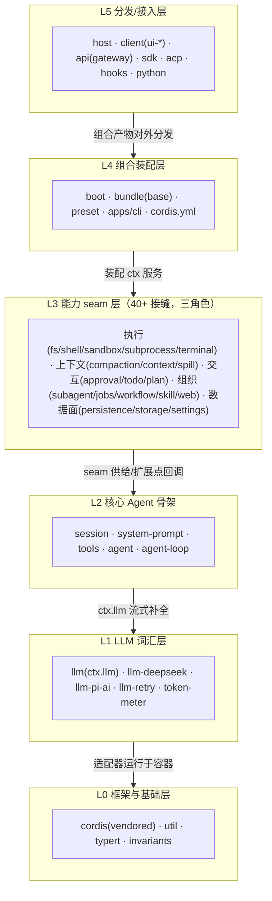

# deepseek-harness 分层技术架构分析

分析日期：2026-09-26。范围：全仓库分层结构——每层包含的组件、各组件职责，以及组件间的调用关系。依据 [docs/architecture.md](../docs/architecture.md)、[packages/README.md](../packages/README.md) 与源码生成的 [docs/module-graph.md](../docs/module-graph.md)、[docs/capability-seams.md](../docs/capability-seams.md) 交叉验证。

## 一、总体架构思想

本项目是构建在 vendored Cordis 之上的插件化 Agent 框架，三条基本原则决定了整个分层形态。

1. **一切皆插件**：没有特权核心。任何组件（工具、UI、事件监听、甚至默认模型选择）都通过 `ctx.effect()` / `ctx.on()` 注册，返回 disposer，可逆、可替换。
2. **组合即配置**：不写代码也能换掉任何部分。`cordis.yml` 声明插件行，profile/bundle 机制按序叠 patch（详见 [packages/bundle/base/README.md](../packages/bundle/base/README.md)）。
3. **能力接缝（Capability Seam）三角色**：每个能力由 Service Definition（声明接口）/ Provider（实现）/ Consumer（消费，通常是模型可见工具）组成，三者齐备才算完整接缝。

## 二、分层总览



依赖严格向下：上层依赖/调用下层，连接方式只有三种——`ctx` 服务直接调用、waterfall 事件拦截（须调用 `next()` 委托）、持久 session 事件（写入 append-only 日志）。

## 三、逐层组件与职责

### L0 框架与基础层

| 组件 | 职责 |
| --- | --- |
| `vendor/cordis` | IoC 容器内核：Context、effect/on/waterfall、插件生命周期、可逆注册、瀑布语义 |
| `packages/util` | 零依赖工具：Branded 类型、home 路径、原子写、timeout、输出保留、启动环境 |
| runtime-diagnostics / invariants | `ctx.invariants`：断言"自有关系"的运行时不变量（如 Model-visible ⟺ logged） |
| `typert` 组 | 类型图 generator/loader/registry/protocol，支撑跨进程类型化 RPC |
| `native/landlock-run` | Linux 沙箱 node addon 的源头（`native/`） |

### L1 LLM 词汇层

| 组件 | 职责 |
| --- | --- |
| `llm`（`ctx.llm`） | 消息/流/工具调用词表 + 适配器接缝接口（`llm/stream` waterfall） |
| `llm-deepseek`、`llm-pi-ai` | 具体 Provider 实现 |
| `llm-retry` | 重试策略（同样是 `ctx.llm` 的一种实现包装） |
| `token-meter` | token 用量计量 |

消费者为 `agent-loop` 与 `compaction-basic`。这一层把"模型长什么样"收敛为一个接缝，上层完全不感知 DeepSeek 协议细节。

### L2 核心 Agent 骨架（产品 API 脊柱）

| 组件 | ctx 键 | 职责 |
| --- | --- | --- |
| `session` | `ctx.sessions` | append-only SessionEvent 日志，一切持久事实的唯一事实源 |
| `system-prompt` | `ctx.systemPrompt` | prompt 段与工具 schema 的装配 |
| `tools` | `ctx.tools` | 作用域工具注册表 + 守护执行管线 |
| `agent` | `ctx.agents` | Agent 接口、活动注册表、`agent/*` 事件域 |
| `agent-loop` | `ctx.agentLoop` | 默认驱动 `ReactLoopAgent`（[packages/core/agent-loop/src/agent.ts](../packages/core/agent-loop/src/agent.ts)），phase 状态机 idle/maintenance/running |
| `scope` | — | per-agent 上下文扩展原语（agent 自己的 `ctx` 视图） |
| `agent-default-model`、`agent-tool-presentation` | — | 默认模型选择、工具 UI 渲染意图 |

### L3 能力 seam 层（40+ 接缝，按职能分五类）

- **执行类**：`subprocess`（进程树）→ `shell`（bash/pwsh × local/sandbox 四种 Provider + `tool-bash`/`tool-pwsh` Consumer）→ `sandbox`/`sandbox-policy`（bwrap/Landlock/Seatbelt/Windows ACL 受限令牌）；另有 `fs`、`terminal`（持久会话）、`lsp`、`code-runtime`。
- **模型上下文类**：`compaction`（压缩）、`context`（请求上下文）、`spill`（溢出）、`attachment`。
- **交互类**：`interaction`（approval/permission/ask-user/commands）、`plan`（logged state）、`todo`、`feedback`。
- **组织类**：`subagent`（6 种 Provider：acp/claude-code/codex/dsh-sdk/fork-in-process/spawn-in-process + 3 个工具）、`jobs`、`workflow`、`skill`、`web`（search/fetch）、`mcp`。
- **数据面**：session 持久化组（persistence/projection/titles/telemetry）、`session-query`、`storage`、`settings`、`credentials`、`identity`、`workspace`。
- **横切**：`guard`（loop-hygiene、tool-timeout）、`extensions`（agent 自修改/自挂载插件）。

### L4 组合装配层

- `boot`：app 启动胶水、命令行解析、profile 引导。
- `bundle`：`dsh-base`（每个 profile 的第一层基础插件栈）+ web-app/headless 等发行组合；平台门控在此完成（win32 禁 bash-sandbox、启用 pwsh 栈）。
- `preset`：per-session 组合（agent-presets/persona）。
- `apps/cli`：`dsh` 可执行入口。

组合顺序：空 entry 列表 → `profile.bundles` 依序 → profile patch → home patch → `--patch` overlay；patch 按 id 整行替换。

### L5 分发/接入层

- `host`：webserver、apiproxy、frontend 静态托管。
- `client`：connection/runtime/modules/hmr + 30 余个 `ui-*` 插件（Web 前端）。
- `api`：api-remotes（远程 BFF 装配）+ api-gateway（Typert RPC 网关，消费 `ctx.typertGateway`）。
- `sdk`：JSON-RPC protocol/server/client；`acp`：自动化 Agent Client Protocol 服务；`hooks`：Claude Code/Codex 桥 + wire-protocol 库。
- `python/`（Python SDK）、`apps/web`（Vite 前端 + 快照测试）。

支撑层：`examples`（可运行 cordis.yml 叶子）、`test-support`（快照/测试基建）。

## 四、组件间调用关系

### 1. Turn 主链路（核心调用链）

```text
turn/start
  → 领取 inbox 下一条输入 + 一条排队消息
  → 装配 prompt 段 + 工具 schema
  → agent/pre-step (waterfall，可 reject)
     step/start → 输入写入日志(user/message) → 从日志推导模型历史
     agent/request → llm/stream → assistant/chunk* → assistant/message
     tool/call* → tools 守护管线 → tool/result*
     工具欠一次请求或有新输入 → 领取 → 下一个 step
  → agent/turn-stopping
turn/end
```

对应实现即 `ReactLoopAgent`：它依赖 `dsh-agent`（接口与事件）、`dsh-llm`（流装配）、`dsh-session`（日志头）、`dsh-system-prompt`（段渲染），在自己的 `scope.ctx` 上运行。模型历史永远从 session 日志重建，而不是内存状态。

### 2. 工具执行五阶段管线

`ctx.tools` 的执行不是简单函数调用，而是瀑布事件链（[packages/core/tools/src/index.ts](../packages/core/tools/src/index.ts) 中 4 处 `ctx.waterfall`）：

```text
tools/pre-policy → 单调 guards → around 分发 → tools/post-policy → final-result 观察
```

任何插件都可在任一阶段插入（审批、超时、脱敏），且必须调用 `next()` 委托，否则短路整条链。

### 3. Seam 三角色装配示例

- **llm seam**：Definition = `llm`；Provider = `llm-deepseek`/`llm-pi-ai`/`llm-retry`；Consumer = `agent-loop`、`compaction-basic`。
- **shell seam**：Definition = `shell`；Provider = `bash-local`/`bash-sandbox`/`pwsh-local`；Consumer = `tool-bash`、`tool-pwsh`、`hooks-*`；而 bash Provider 又向下消费 `subprocess` seam 与 `sandbox-policy`。

### 4. 三种连接机制

1. **ctx 服务直接调用**（`ctx.llm.stream(...)`、`ctx.fs.*`）：类型化、同步语义。
2. **Waterfall 事件**（`agent/pre-step`、`agent/request`、`tools/*`、`llm/stream`）：可拦截、可改写、须 `next()`。
3. **Session 事件**（`session/*`）：持久事实，写入 append-only 日志，驱动 UI 投影、replay 与持久化——即"Model-visible ⟺ logged"约束的载体。

### 5. 依赖方向规则（保证层间单向）

- 扩展插件只依赖 Service Definition，不依赖具体 Provider（可被 cordis.yml 换掉）。
- UI/hook/工具插件依赖 `dsh-agent` 而非 `dsh-agent-loop`（loop 本身可替换）。
- 只有组合 bundle 允许依赖 spine 插件；生成的 [docs/module-graph.md](../docs/module-graph.md) 与 [docs/capability-seams.md](../docs/capability-seams.md) 由 CI 门禁保证与源码一致。

## 五、一句话总结

L0 提供容器，L1 定义模型词汇，L2 用五件套（session/prompt/tools/agent/loop）搭出 Agent 骨架，L3 以 40+ 三角色接缝横向供给能力，L4 把它们组合成 profile，L5 通过 CLI/Web/API/ACP/SDK/Python 分发给外部世界——层间只有 ctx 服务、瀑布事件、持久日志三种连接方式，依赖严格向下。
